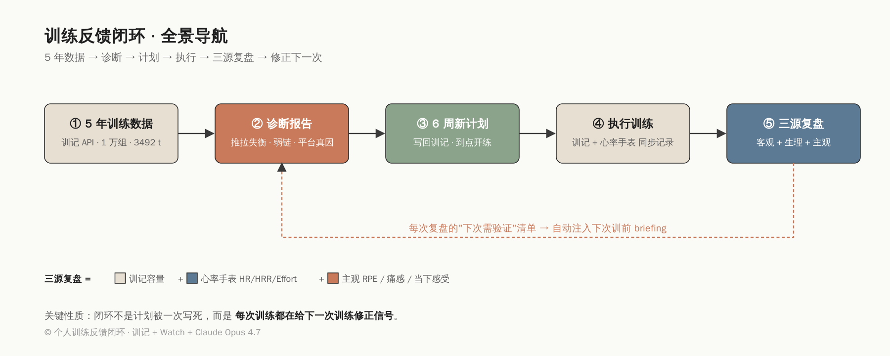
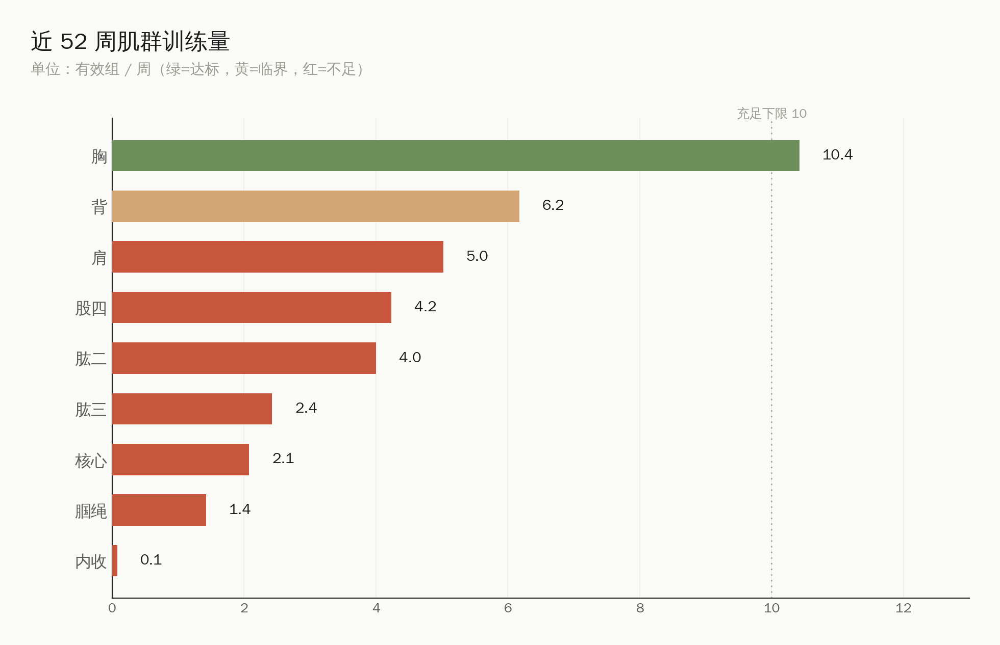
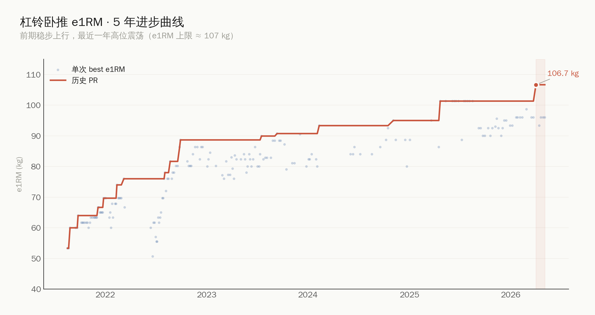
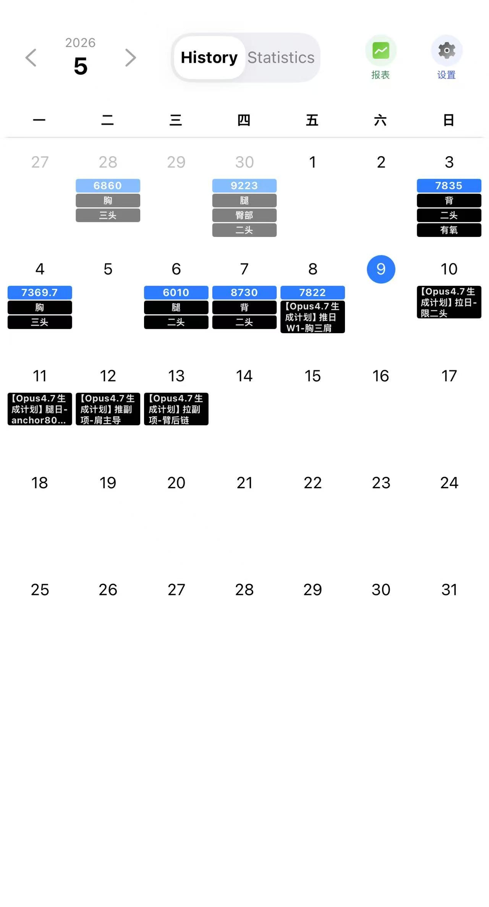
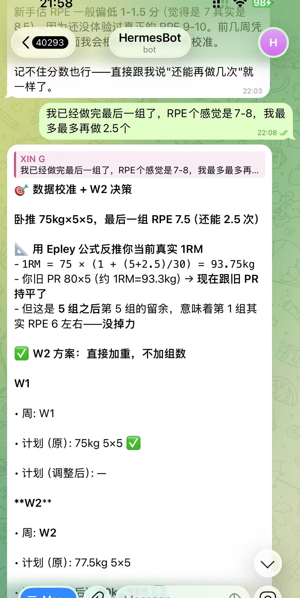
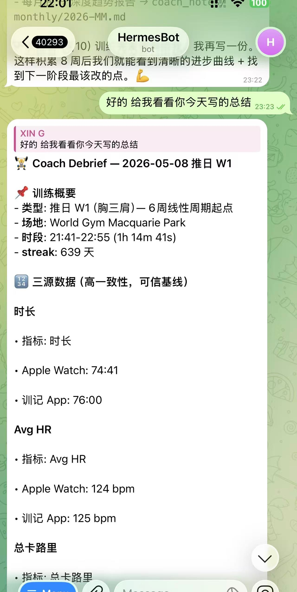
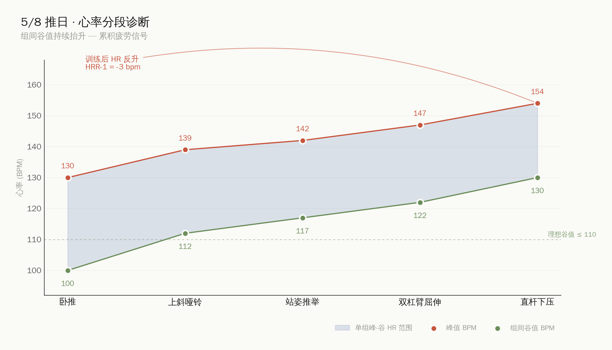

# 我用 5 年训练数据 + AI + Apple Watch，给自己搭了一套训练反馈闭环

> **30 秒速读**
> - 想做的事：让 AI 当一个能看到我所有训练数据的"远程教练"
> - 解决了：找出平台期的真因 / 训中实时校准强度 / 训后量化复盘
> - 适合谁：训练 1 年+、有连续记录、卡平台期或想做精细化提升的人
> - 门槛：不需要写代码——把训记截图 + Watch 截图丢给 ChatGPT/Claude 就能复刻八成
> - 不解决：动作模式问题、伤痛诊断、新手"练不练"的问题

**先报一下底**：男 / 173cm / 67kg / 30 岁 / 自由力量训练 5 年 / 体脂 ~12-14% / 训练目标偏体型 + 力量平衡。常练场地 World Gym Macquarie Park。这套东西能不能套到你身上，先看下面这张分层表：

| 训练年限 | 这套方法对你 | 建议 |
|---|---|---|
| 0-1 年（新手） | **不建议** | 你需要的是去练、把动作模式打稳，不是分析。数据少、噪声大，做诊断容易陷入"分析瘫痪" |
| 1-3 年（中阶） | 部分有用 | 单次训后复盘可以做，长期诊断报告意义不大——周期化、加重量优先 |
| 3 年+ / 平台期 | **核心受众** | 数据足够、感觉够准、平台期真因往往藏在结构性失衡里，这是 AI 最擅长挖的 |

## 一、为什么做这件事

我用「训记」记训练快 5 年了，最近卡平台期挺久的——卧推 80kg×10 一年没动，深蹲、硬拉 PR 都已经 300 多天没刷新。

平台期我先排除了几个常见原因：训练频率没掉（周 4-5 次稳定）、睡眠基本 7h+、蛋白每天 1.6-2.0 g/kg、体重小幅上涨没在减脂。所以问题大概率不在恢复，而在训练结构本身——但 5 年下来记录有 1 万多组，靠人脑去看其实看不出什么名堂，最多能感觉到"最近卧推没涨"，再深就没了。

LLM 出来之后我就想，反正手里有这么多年的高质量数据，模型现在切片、做长期对比、找模式都不费劲，那不如让它来帮我看看——到底我哪里练得不对，平台期是怎么来的。动机就这么简单。

试完之后发现，不仅找出了平台期的真实原因，还顺手搭了一套训前-训中-训后的反馈闭环，下面拆开讲。



> 上面这张图是全篇的"导航"，建议先看一眼有个全局观。下面会按 ①→②→③→④→⑤ 的顺序逐节展开，赶时间可以直接挑你最在意的环节看。

## 二、把训记 5 年的数据先拉下来

> 💡 **不会写代码也能玩**：下面这一节有 Python，但不是必须的。如果你不写代码，跳过这节去第三节——把训记的"训练记录"页面截图、Watch 的 Summary 截图、动作视频，直接丢给 ChatGPT/Claude，让它做"训练分布诊断"+"单次复盘"，能挖出八成同样的盲点。本文后面的所有诊断和复盘思路对纯截图玩法都成立。

「训记」给 VIP 开了一个 LLM 接口，可以按天导出训练记录。我写了个 Python 客户端，从 2021 年 8 月一直拉到 2026 年 5 月：

```
557 个训练日 · 10998 组 · 92 个不同动作 · 总容量 3492 吨
```

flatten 成 set-level 的 DataFrame：

```
date | exercise | set | weight_kg | reps | rest_s | muscle_primary
```

然后写了个动作→肌群的分类器（chest / back / shoulders / quads / hams / glutes...），任何切片都能做透视。

### 训记 API 现在的几个限制

实际跑下来发现，开放接口现在覆盖的范围比我以为的窄。下面这几个限制如果不知道，分析就会做出"看起来很全、其实有盲区"的结论：

| 限制 | 影响 |
|---|---|
| 不支持身体数据（体重、围度、体脂） | 没法分析容量变化和体重的相关性 |
| 不支持饮食数据 | 蛋白摄入、热量缺口/盈余进不来 |
| 不支持动作备注 | 你在 App 里写的"今天肩膀紧""换装备了""RPE 9"全部读不到 |
| 不支持心率图导出 | 即使 App 已经从 Apple Watch 同步了 HR 曲线，接口只返回 avg HR，分钟级拿不到 |
| 不返回 RPE / RIR | 主观强度得自己另存 |
| 导出训练日和 App streak 对不上 | App 显示 639 天，导出只有 557 天，差了 82 天，原因还没排查清楚 |

这些限制基本决定了我后面要搭"主观反馈日志 + Watch 截图 OCR"——训记是一个不错的客观容量底座，但单靠它做不了完整诊断。如果未来这几项能开放（特别是分钟级心率和动作备注），整个分析的精度会再上一个台阶。

接口本身还有几个小坑：成功响应里 `success` 字段会是 false（要看 res 是不是数组）；每个 (date, endpoint) 90 秒锁死，bulk fetch 必须 throttle；只有 VIP 能用。

## 三、让模型出一份诊断报告

我没让模型做花哨的可视化，而是按"目标 → 诊断 → 处方"的医学风格写一份结构化报告。几个最关键的发现：

| 维度 | 数据 | 诊断 |
|---|---|---|
| 推类 vs 拉类有效组比 | 1.37 | 偏推，背部/后束欠刺激 |
| 腿部有效组/周 | 5.9 | 推类 18.5 的 1/3，最大短板 |
| 二头:三头容量比 | 2.25:1 | 反了，应该 1:1.2 |
| 推举 13 个推日做了 0 次 | — | 肩前束几乎没练过 |
| 卧推近一年斜率 | -3.4 kg/年 | 平台期但不是力量退步，是结构问题 |

这张图最直观：



腿部、腘绳、肱三整段红色——说我没认真练过腿都算是给自己留面子。胸 10.6 组/周看起来挺多，但整体结构很失衡，这种状态再加大强度也没用，是结构问题。

卧推平台期是这样的：



蓝点是每次训练 best e1RM，红线是 cummax PR，红色阴影那段就是平台期。仔细看蓝点的分布，单次表现并没有衰退，只是再也突破不了上限——说明力量基础还在，缺的是周期化和弱链补强。

读完报告我反而踏实了。卡死不是因为练得不够猛，是 5 年来都在重复同一套差不多的训练，缺周期化、缺辅助动作、弱链没刺激到。

## 四、基于报告重写训练计划

诊断结论清楚之后，让模型帮我写了一套 6 周的 PPL（推/拉/腿）线性周期，几个原则：

- 同肌群至少隔 48 小时
- 腿日权重显著拉高，从全年占比 6% 拉到 18%
- 加入推举、面拉、罗马尼亚硬拉这些之前没怎么练过的弱链动作
- 杠铃重量只允许 5kg 的倍数——我健身房 1.25kg 杠铃片很难找，纸面上写 77.5kg 没问题，到现场配不出来就废了。这种细节模型一开始不知道，是我反馈之后写进系统提示词的

### 腿日具体长这样（抄作业版）

腿是最大短板，这里展开一下。一个腿日大概 60-70 分钟、5 个动作 18-20 个工作组：

| 顺序 | 动作 | 组×次 | 强度 | 备注 |
|---|---|---|---|---|
| 0 | 髋活化 + 蹲位呼吸 | 5min | — | 蚌式、髋桥、世界最棒拉伸各 1 组 |
| 1 | 杠铃后蹲 | 4×5 | 75-82.5kg（RPE 7-8） | 主项，每周 +2.5kg 直到末组 RPE 9 |
| 2 | 罗马尼亚硬拉 | 4×8 | 70-80kg（RPE 7） | 后侧链补强，全程感受腘绳 |
| 3 | 保加利亚分腿蹲 | 3×10/侧 | 哑铃 12-15kg | 单侧不平衡修正 |
| 4 | 腿弯举 | 3×12 | 力竭组×1 | 腘绳孤立 |
| 5 | 站姿提踵 | 4×15 | 渐进超负荷 | 小腿之前完全没练过 |

原则：主项后蹲不上 RPE 9 以上，给后续单边和后链留体力。腘绳：股四 = 1:1 是底线（之前 1:3，严重失衡）。

中阶/进阶可以直接抄；新手别从这练，先把双腿后蹲学会再说。

### 怎么把计划写回训记

训记的写入接口（`/api_upsert_trains_for_llm`）接受一行字符串作为某天的训练，格式大致是：

```
YYYY-MM-DD,【标题】,1.动作名,1组,Wkg,R次,time:Ts,2组,Wkg,R次,...
2.动作名,1组,Wkg,R次,...
```

我把 6 周计划拆成每天一行，循环写入未来 42 天。到点开 App 今天的训练已经躺在那等我，不用临场想。

写入流程几个要注意的：

| 点 | 说明 |
|---|---|
| 标题字符过滤 | 服务端会拒绝半角 `[ ]`，必须用全角 `【】`，其他 ASCII 标点也容易被拒 |
| 批量限速 | 每个 (date, endpoint) 90 秒锁定，bulk 写必须 sleep 95s |
| upsert 不是 delete-and-replace | 不在本次提交里的旧记录会被保留，要替换得显式带 `id:LOCALID` |
| 每行 ≤ 1500 字符 / 单次 ≤ 12 行 | 超出会拒绝 |
| `time:Ts` 不是真实组间休息 | 写入时设的"建议组间休息"，App 不会拿它去 override 实际计时器；导出回来也是写入时的值，跟当次训练真实秒数无关 |

最后那条特别坑——我一开始以为把组间设成 180s 写进去，未来分析时就能拿到真实休息时长，结果发现导出来的 time 始终是计划时填的那个数。这意味着真实组间休息没法从训记 API 复原，只能靠 Apple Watch 的 HR 曲线时间戳反推（这也是后面那张 HR 分段图里我用 Watch 时间倒推每个动作时段的原因）。

写入跑通之后，训记 App 里的日历大概长这样——未来几天的训练标题都是 `【Opus4.7生成计划】xxx`，到点直接打开做就行：



把"计划写入"打通最大的好处其实不是省时间，而是让 AI 设计的计划和实际执行落到同一张表里——后面"计划 vs 实际"的偏差表才有意义。

## 五、训练后的反馈循环——闭环真正起作用的地方

写过训练计划的人都知道一个尴尬：计划是死的，身体是活的。睡眠差、肩膀不舒服、当天觉得"75 太轻了能上 80"，纸面计划没法响应这些信号。

所以我们设计了一个三方数据交叉验证的训后复盘流程。

### 三个数据源

| 来源 | 提供什么 |
|---|---|
| 训记 App | 客观容量：动作 / 重量 / 组次 |
| 心率手表（我用 Apple Watch） | 接口拿不到的指标：avg/peak HR、HRR、卡路里、Effort 评分 |
| 我自己 | RPE、痛感、是否打折、当下感受 |

> 不是必须 Apple Watch。Garmin、Polar、华为、小米，任何能记录分钟级心率曲线、能截图导出的设备都行——后面分析靠的是 HR 时间序列和 HRR 数字，不依赖 Apple 健康那套生态。

每次训练完，我把训记截图、Watch 截图、动作视频丢给 AI，它会做几件事：

1. OCR 把截图里的数据抽出来
2. 跟本地 parsed JSON 对照，验证一致性
3. 算 e1RM = w × (1 + reps/30)，对照历史 PR
4. 把 Watch 的 HR 曲线按动作分段，诊断组间恢复
5. 输出一份结构化复盘 markdown 存档

### 训中：随手报一句 RPE，AI 立刻校准下周计划

整套闭环里我一开始没料到的爽点其实在训练中——组间歇着的两三分钟掏出手机敲一句"刚做完最后一组，最多还能做 2 个"，AI 几秒就回过来：当组 e1RM 算完了、跟历史 PR 比完了、本周末组到不到位、下周该不该加重，全在一条消息里。

下面这张是末组卧推刚做完发出去的对话。我说"RPE 7-8，最多再做 2.5 个"，AI 直接套 Epley 反推 1RM = 93.75kg，跟我去年 80×5 的旧 PR 持平，意思就是力量没掉、W2 加重就行：



第二张是训完坐在更衣室让它出复盘。一句"给我看看你今天写的总结"，三源数据对照表、HR 分段、风险信号、下次需验证清单一份齐活，最后归档进 `coach_notes/` 里：



把这两段串起来就是闭环最关键的那一截：训练中一句话下去，AI 拿当下数据点更新它对我的认知（"这周状态不错，可以加 2.5kg"）；训练完整份复盘下去，写进归档，下次训前 briefing 又会自动调出来。这中间没有"打开电脑分析数据"那一步——人在健身房里，AI 在云上，我们俩共用一份不停被刷新的训练上下文。

这种沟通方式有几个挺重要的设计原则，是我用了几次摸出来的：

- **训中只发主观感受 + 客观数字**（重量/次数/RPE/还能做几个），AI 只回当下校准信息，不展开下周/下月周期表——你正在做下一组，不需要规划干扰
- **用"还能做几个 (RIR)"代替凭空给 RPE 打分**——业余训练者对 RPE 的估计普遍偏低 1-1.5 分，但"我最多再做 2 个"这种描述非常稳定，模型可以反推
- **当下决策只到本周维度**——比如"末组 RPE 7.5 → W2 按计划加 5kg"，再远的它会主动闭嘴

这一步把"训练中你的真实状态"塞进了系统的认知里。光看训记的重量/次数其实是不够的，同样 75kg×5×5，末组 RPE 6 和 RPE 9 是完全不同的两次训练，但训记看不出区别。

### 训后：一份真实复盘里我学到的几件事

5 月 8 号推日 W1，看起来很普通的一次训练，复盘揪出了三个我自己根本意识不到的问题。

**HR 谷值持续抬升**



绿色方块是每个动作的组间 HR 谷值。前段卧推谷值能跌到 100，中段推举只能跌到 117，到末段直杆下压再也跌不回 110 以下。意味着后半段心血管已经进入持续高负荷，**组间休息时长其实不够**。但凭感觉训练我根本察觉不到。

**HRR-1 异常**

训练结束 1 分钟，心率从 147 反而升到 150，HRR-1 = -3 bpm（健康标准 ≥12，训练有素的人 20-30）。不是身体差，是没做主动冷却导致副交感神经激活滞后。修正动作是训练末尾必须 3 分钟主动冷却（慢走 + 拉胸 + 拉肩），把 HR 主动降到 100 以下结束。

> ⚠️ HRR 个体差异极大，光腕表 HR 误差也有 ±3-5 bpm（运动场景下更大）。**单次绝对值不要焦虑，建议看 10+ 次的趋势**。如果你长期 HRR-1 < 10 而且伴随静息心率持续抬升、训练后疲劳累积，再去找医生，不要直接拿 AI 的解读当诊断。
>
> 关键参考：Cole CR et al., NEJM 1999（HRR 与全因死亡率）；Buchheit 2014（HRV/HRR 监测综述）；McKune 2019（主动冷却对副交感激活的效果）。

**推举 e1RM 突破 +19%**

历史 PR 42.6kg → 当天 e1RM 50.7kg。直接验证了报告里"推举是被忽略的潜力点"的诊断。之前 13 个推日 0 次推举，加进来一次就涨了 19%——这种白送的进步对一个练 5 年的人来说挺稀罕。

这三件事如果没有 Watch 数据 + 自动复盘，我大概永远不会发现。力量训练者普遍忽视有氧/恢复指标，但这些往往就是平台期的真因之一。

### 复盘的存档结构

```
~/个人训练教练/feedback/
├── coach_notes/
│   ├── 2026-05-08_推日W1.md      ← 单次复盘
│   └── weekly/2026-W19.md         ← 周聚合
├── sessions.jsonl                 ← 结构化反馈日志
└── prs.jsonl                      ← PR 追踪
```

每次复盘必含：

- 三源数据对照表
- 动作执行 vs 计划偏差表
- 主观 RPE vs 客观 e1RM 对照
- 风险信号（疼痛 / 关节 / HR 异常）
- 量化追踪指标（HR/容量比、卡路里/容量、时长/组数...）
- 下次需要验证的清单——这是闭环的关键

### 完整复盘长这样（以 2026-05-08 推日 W1 为例）

光说结构不直观，下面是一份真实的复盘原文（贴一次给大家感受密度，后面就不再贴了）。

> ⏩ **赶时间可以跳过这一节，直接看第六节闭环全景图**——下面是单次复盘的"开箱样品"，看一眼密度就够。

---

**🏋️ Coach Debrief — 2026-05-08 推日 W1**

**📌 训练概要**
- 类型：推日 W1（胸三肩）— 6 周线性周期起点
- 场地：World Gym Macquarie Park
- 时段：21:41–22:55（1h 14m 41s）
- streak：639 天

**🔢 三源数据（一致性 ±1%，可作长期基线锚点）**

| 指标 | Apple Watch | 训记 App |
|---|---|---|
| 时长 | 74:41 | 76:00 |
| Avg HR | 124 bpm | 125 bpm |
| 总卡路里 | 618 (active 516) | 511 |
| HR 范围 | 84–158 | 89–158 |
| Effort | 7/10 (Hard) | — |
| 总容量 | — | 7,822 kg |
| 工作组数 | — | 23 组 |

**💪 动作执行 vs 计划**

| 动作 | 计划 | 实际 | 偏差 |
|---|---|---|---|
| 杠铃卧推 | 5×5 @75kg | 5×5 @75kg ✅ | 0 |
| 上斜哑铃 | 4×8 @22.5kg | 4×8 @22.5kg ✅ | 0 |
| 站姿推举 | 4×6 @37.5kg | 30→40×4（5 组）| +1 组, +2.5kg |
| 双杠臂屈伸 | 3×8 自重 | 3×8 ✅ | 0 |
| 直杆下压 | 3×12 @22.5kg | 21.25→25×2 ✅ | 0 |

→ 执行率 100%，自主决策（推举升 40kg、下压走 25kg）合理且更接近最优强度。

**🎯 主观-客观对照**

| 指标 | 主观 | 客观 |
|---|---|---|
| 整体努力 | RPE 7-8 | Watch Effort 7/10 ✓ |
| 卧推强度 | 末组 RPE 7.5 | e1RM 93.75kg = 历史 PR 持平 ✓ |
| 推举强度 | 末组 RPE 8 | e1RM 50.7kg = +19% vs 历史 PR ✓ |
| 上斜强度 | 末组 RPE 7 | e1RM/侧 30.75kg ✓ |

→ 主观估计与客观推算全部一致，证明 RPE 报告可信，可作为周期决策主信号。

**🫀 心率分析 — 组间恢复诊断**

- **谷值持续抬升**：卧推谷值 95-105 → 推举 115-120 → 下压 130+，后段心血管再也跌不回 110 以下，组间休息时长不够
- **峰-谷差从 30 → 20 BPM 收窄**：力量训练理想状态是每组让 HR 跌回静息 +30-40bpm，前 15 分钟达到，后 30 分钟差距收窄
- **没有结尾冷却**：22:55 直接断片在 158 BPM 高位，缺少 2-3 min 主动冷却

具体建议：

| 动作类型 | 实际组间 | 建议组间 | 依据 |
|---|---|---|---|
| 主项大重量复合 | ~120-150s | 180-240s | HR 跌至 100-110 再开 |
| 副项复合 | ~90s | 120-150s | HR 跌至 115-120 |
| 孤立 + 力竭组 | ~60s | 60-90s ← 保持 | HR 维持 130 反而促代谢压力 |
| 训练末尾 | 直接结束 | 2-3 min 主动冷却 | 慢走/胸椎旋转/肩绕环 |

**🫀 HRR 异常**

来自 Watch 的 zones + post-workout 数据：

- HR Zones：Z1 (<140) 1:02:50 (83%) ✓，Z2 09:58 (13%)，Z3 01:53 (2.5%)，Z4-5 0
- Post-Workout：22:55 结束 147 bpm → +1min **150 ⚠️ 反升** → +2min 145
- **HRR-1min = -3 bpm**（健康标准 ≥12，训练有素 20-30）

不是恢复差，是因突然结束无冷却导致副交感神经激活滞后（Cole 1999 NEJM, Buchheit 2014）。

→ 下次必做主动冷却 3 min。新基线指标：HRR-1min，目标 ≥ 15 bpm。

**⚠️ 风险信号**

- **左肩活动度不足**（用户主动报告）— 训前未做肩部热身
  - 影响动作：卧推、推举、上斜哑铃（前束/肩袖参与）
  - 后续：所有上肢日开头必加 5-8min 肩部活化块
  - 监控：连续 2 次同一信号 → 强制减重 + 评估

**🌟 高光时刻**

1. 推举 e1RM 突破 +19% — 年初 PR 42.6kg → 今日 50.7kg。说明 2026 年开始练推举（之前 13 次推日 0 次推举）的决策极其正确，肩前束有巨大未开发空间
2. 三源数据交叉验证一致 — 第一次有 Watch+训记+主观三方对照，未来追踪可信
3. 自主调整能力强 — 推举从 37.5 升到 40，下压用 25kg 取代 22.5。这种"现场微调"是高水平训练者的标志

**📈 量化进步基准（截至今日）**

| 主项 | 今日 e1RM | 2026 历史 PR | Δ |
|---|---|---|---|
| 杠铃卧推 | 93.75kg | 80kg×5 (e1RM ~93.3) | 持平（持续平台期 12 月）|
| 站姿推举 | 50.67kg | 42.6kg | **+19%** ⭐ |
| 上斜哑铃/侧 | 30.75kg | (待回填) | — |

**🔍 可量化追踪指标（建立基线）**

- HR/容量比 = 124 / 7.82 = 15.86 bpm/t（越低越说明心血管经济性好）
- 卡路里/容量 = 516 / 7.82 = 66 kcal/t
- 时长/组数 = 76min / 23组 = 3.30 min/组
- 主观-Watch Effort 一致性 = ±0（完美校准）

→ 这 4 个指标每次训练计算，10+ 次后做趋势图。

**🎓 教练观察**

1. **平台期破解的真正瓶颈不在卧推**：你卧推卡 80kg 一年，但今天 75×5×5 RPE 7.5 说明力量基础并没有衰退。卡死是因为缺乏周期化结构和辅助动作，不是基础力量不够
2. **腿部数据缺失**：今天没练腿，但腿是你最大短板。5/11 腿日才是本周真正的考验
3. **Watch effort 7 是黄金区间**：每次训练保持在 5-7 之间是可持续训练量；持续 8+ 会累积疲劳，<5 强度不够

**🔄 下次（5/10 拉日 W1）需要验证**

- [ ] 杠铃划船 70kg×6 末组 RPE — 校准拉力周期起点
- [ ] 二头限组数（3 组）后是否仍感觉够刺激
- [ ] 引体向上不带辅助能做几个（评估真实背力）
- [ ] 训前肩部热身后，划船是否更顺畅 ← **关键验证项**

---

读完一遍其实就明白这套东西在干嘛了：把训练里所有可以量化的信号——客观的（容量、HR、时长）、主观的（RPE、痛感）、对比的（计划 vs 实际、今日 vs 历史 PR）——全部放到同一份文档里互相印证，让"今天这次训练好不好、下次怎么改"变成一个可以被讨论的具体问题。

最关键的其实是最后那个"下次需验证"清单——它会被自动塞进下一次训前 briefing，让闭环真正闭上。

## 六、整个闭环长这样

```
训记 5 年数据
      │
      ▼
  诊断报告 ──── 找进步点
      │
      ▼
  新训练计划 ── 写回训记 App
      │
      ▼
  执行训练（训记 + Watch 同时记录）
      │
      ▼
  训后三源复盘
      │
      ├─→ 风险信号 → 下次必做规则（肩部热身、主动冷却等）
      ├─→ 主观-客观一致性 → 校准 RPE 信号可信度
      ├─→ e1RM 对比 → 周期推进 / 维持 / 减重决策
      └─→ "下次需验证项" → 进入下一次训前 briefing
              │
              └────────────► 回到执行训练
```

最有价值的不是任何单一环节，是每一次训练都在给下一次训练提供修正信号。计划不再是 6 周固定的，每次训练后都会被微调。模型会记住"上次左肩有点紧""上次末段恢复差""上次推举其实还有空间"，下次训前 briefing 这些都会自动浮上来。

## 七、踩过的几个坑

- 不要把 RPE / 主观感受写进训记 App 的动作名（会污染历史数据）。主观数据存到本地 jsonl，跟客观数据物理隔离。
- OCR 出来的数据必须人工校验——Watch 截图的 BPM 数字偶尔会被识别错。
- 训练中不要让 AI 输出未来 6 周计划——你正在做下一组，需要的是当下数据点的解读，不是规划干扰。
- 关键发现要写成硬规则沉淀——比如"上肢日必加肩部热身 5-8 分钟"必须写进系统提示词，不然下次模型还会忘。
- 重量取整要尊重健身房现实，写计划之前先确认你那能找到的最小杠铃片是多少。

## 八、什么情况下不要这么做（重要）

健康类内容必须把边界讲清楚，下面这几条比上面所有花活都重要：

- **AI 不替代真人评估关节伤痛**：肩、腰、膝任何持续 2 次以上的疼痛，先停训去看运动医学医生或物理治疗师。AI 看不到你的动作模式、看不出关节囊问题，给的建议只能算参考。
- **新手别从分析切入**：练龄 < 1 年请去练，把深蹲、硬拉、卧推、推举、引体五个基础动作的模式打稳。数据少做诊断会过拟合到噪声上。
- **赛前 / 比赛人群请找认证教练**：体重控制、peak week、装备力量训练这些场景需要现场经验，不是 AI 当下能可靠覆盖的。
- **数据噪声大于信号时果断停**：连续 2 次出现关节痛、HRR 异常崩塌、静息心率连周抬升 > 5bpm，停训减量、找医生，而不是再问 AI 一遍。
- **不要把 AI 的解读当诊断**：HRR、心率、RPE 任何单次绝对值都有误差，是趋势信号，不是医学结论。

## 九、30 分钟入门路径（不写代码版）

如果你也想试，最低成本的做法：

1. 打开你的训练记录 App（训记 / Strong / Hevy 都行），导出或截图最近 4 周
2. 把截图发给 ChatGPT 或 Claude，提示词大致：「这是我最近 4 周的训练记录，按肌群算有效组数、推拉腿占比、找出失衡点和潜在弱链动作」
3. 下次训练戴心率手表，训完把训记本次截图 + Watch Summary 截图一起发，让它做单次复盘（容量、HR 谷值、HRR、主观 RPE 一致性）
4. 把每次复盘最后的"下次需验证"清单截图存下来，下次训前丢给 AI 当 briefing 参考
5. 跑两周，看有没有比凭感觉多挖出 1-2 个盲点——有就继续，没有就停

整套流程零代码，纯对话，半小时上手。

---

工具栈：训记 App（数据源 + 计划下发）+ Apple Watch（生理指标）+ Python + Hermes Agent + Claude Opus 4.7（诊断 / 复盘 / 计划生成）

相关代码 / 报告模板已开源（不含个人数据）：github.com/nullptr0807/xunji-data
